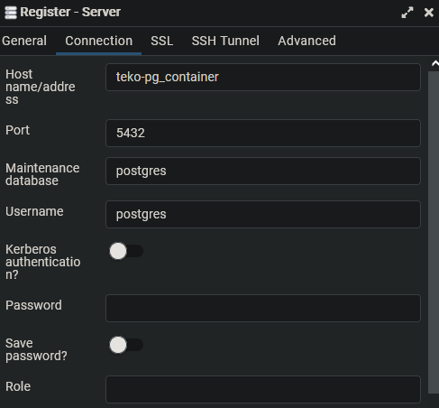

# Netzwerkbetriebssysteme

## Requirements

- docker

## Run

```bash
git clone https://github.com/DaAlbrecht/Netzwerkbetriebssysteme.git

cd Netzwerkbetriebssysteme

docker-compose up -d
```

## Applications

### PostgreSQL

The postgreSQL container is accessable under the following: teko-pg_container:5432

credentials:

- username: postgres
- pw: example

### PG Admin

PG Admin is accessable here: http://localhost:5050

credentials:

- username: demo@demo.com
- pw: root

In order to connect to the database from the pg admin ui go under:

Servers -> Register -> Server -> Connection



use the credentials mentioned in the PostgreSQL section
